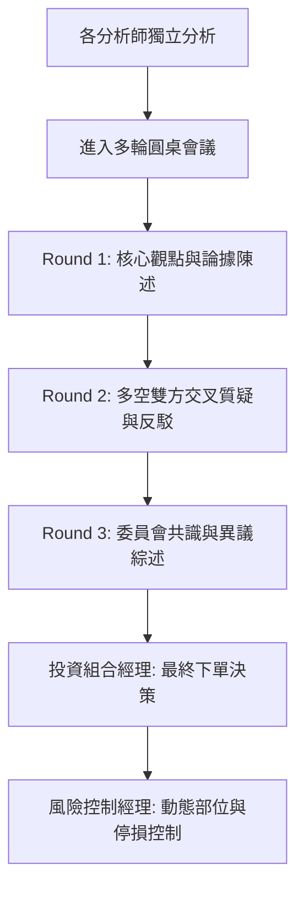

# 🤖 AI Hedge Fund - 投資分析師體系指南 (AGENTS.md)

本系統內建 **14 位各具鮮明風格的專業 AI 投資分析師**，以及 **投資決策委員會（多輪圓桌會議）** 與 **風險與投資組合經理**。每個 Agent 都依據真實投資大師的哲學、經典著作、量化指標及數據來源進行建模。

---

## 📑 分析師全覽目錄

| Agent Key | 分析師名稱 | 核心投資哲學 | 關鍵分析維度 |
|:---|:---|:---|:---|
| `warren_buffett` | **Warren Buffett (華倫·巴菲特)** | 長期價值投資、護城河 | ROE、營業利潤率、內在價值、安全邊際 |
| `charlie_munger` | **Charlie Munger (查理·蒙格)** | 逆向思維、多元思維模型 | 商業模式品質、管理誠信、定價權、資本配置 |
| `ben_graham` | **Ben Graham (班傑明·葛拉漢)** | 安全邊際、雪茄煙蒂投資法 | 流動資產淨值 (NCAV)、本益比、負債比率 |
| `cathie_wood` | **Cathie Wood (凱西·伍德)** | 顛覆性創新、S 曲線成長 | 5 年技術革新週期、AI / 機器人、潛在市場規模 (TAM) |
| `bill_ackman` | **Bill Ackman (比爾·艾克曼)** | 積極主義價值投資 | 簡單可預測之現金流、護城河、營運改造催化劑 |
| `nancy_pelosi` | **Nancy Pelosi (南西·裴洛西)** | 國會內幕與政策順風 | 國會議員交易申報、晶片法案、補貼與國防支出 |
| `michael_burry` | **Michael Burry (麥可·貝瑞)** | 深度逆向價值、泡沫戳破者 | 自由現金流收益率 (FCF Yield)、隱藏債務、逆向新聞情緒 |
| `peter_lynch` | **Peter Lynch (彼得·林區)** | 生活投資學、PEG 選股 | 本益成長比 (PEG)、十年十倍股潛力、淨利潤成長 |
| `phil_fisher` | **Phil Fisher (菲利普·費雪)** | 質化成長股研究 (15 準則) | 研發投入回報、業務拓展能力、管理層前瞻性 |
| `wsb` | **WallStreetBets (WSB 散戶)** | 散戶動能、軋空、YOLO 選擇權 | 散戶熱度 (2md SERP/Reddit)、軋空潛力、選擇權流動性 |
| `technical_analyst` | **Technical Analyst (技術分析師)** | 量價走勢、趨勢跟隨 | RSI、布林通道、MACD、均線架構、支撐壓力位 |
| `fundamentals_analyst` | **Fundamentals Analyst (基本面分析師)** | 財務三表深度審查 | 營收成長、毛利率、自由現金流、利息保障倍數 |
| `sentiment_analyst` | **Sentiment Analyst (情緒分析師)** | 市場心理、新聞與內部人訊號 | 2md 即時新聞情緒評分、SEC 內部人申報買賣超 |
| `valuation_analyst` | **Valuation Analyst (估值分析師)** | 現金流折現模型 (DCF)、同業比較 | DCF 內在價值、EV/EBITDA、歷史乘數區間 |

---

## 🌟 14 位投資分析師詳細說明

### 1. 👴 Warren Buffett (華倫·巴菲特)
* **Agent 檔案**：[src/agents/warren_buffett.py](file:///Users/david/git/tbdavid2019/ai-hedge-fund-API/src/agents/warren_buffett.py)
* **經典語錄**：*"第一條規則：永遠不要賠錢。第二條規則：永遠不要忘記第一條規則。以合理價格收購優秀企業，勝過以便宜價格收購平庸企業。"*
* **分析模型**：
  * 計算企業自由現金流與內在價值 (DCF)。
  * 要求至少 **30% 的安全邊際 (Margin of Safety)**。
  * 審視持續 5 年以上的高淨資產收益率 (ROE > 15%) 與穩定的營收成長。
  * 檢查長期負債是否能在 3~4 年內用自由現金流償清。

---

### 2. 🧠 Charlie Munger (查理·蒙格)
* **Agent 檔案**：[src/agents/charlie_munger.py](file:///Users/david/git/tbdavid2019/ai-hedge-fund-API/src/agents/charlie_munger.py)
* **經典語錄**：*"反過來想，總是反過來想 (Invert, always invert)。如果我知道我會死在哪裡，我就永遠不去那裡。"*
* **分析模型**：
  * 逆向思維檢查：先列出所有可能導致企業破產或衰退的致命弱點（如過度槓桿、技術被替代、愚蠢的管理層薪酬）。
  * 評估企業是否具備不可逾越的定價權與網絡效應。
  * 批判繁雜的金融工程，偏好簡單、透明、可理解的賺錢模式。

---

### 3. 🛡️ Ben Graham (班傑明·葛拉漢)
* **Agent 檔案**：[src/agents/ben_graham.py](file:///Users/david/git/tbdavid2019/ai-hedge-fund-API/src/agents/ben_graham.py)
* **經典語錄**：*"投資操作是基於全面的分析，確保本金的安全並獲得滿意的回報。"*
* **分析模型**：
  * 嚴格的防禦型資產負債表審查：流動比率 (Current Ratio > 2.0)、酸性比率 (Quick Ratio > 1.0)。
  * 清算價值評估 (Net-Net)：市值是否低於淨流動資產 (NCAV)。
  * 本益比 (P/E < 15) 與股價淨值比 (P/B < 1.5)，且 P/E × P/B 不得大於 22.5。

---

### 4. 🚀 Cathie Wood (凱西·伍德)
* **Agent 檔案**：[src/agents/cathie_wood.py](file:///Users/david/git/tbdavid2019/ai-hedge-fund-API/src/agents/cathie_wood.py)
* **經典語錄**：*"顛覆性創新往往在早期被傳統價值投資者嘲笑，但沿著萊特定律 (Wright's Law) 與萊斯定律，技術成本將指數級下降，釋放萬億市場。"*
* **分析模型**：
  * 跨維度評估 5 大創新平台：人工智慧、機器人、基因測序、儲能與區塊鏈技術。
  * 評估 5 年期複合年成長率 (CAGR > 25%) 與潛在市場規模 (TAM)。
  * 忽視短期的傳統本益比，重點關注研發投入強度與營收爆發速度。

---

### 5. 🦅 Bill Ackman (比爾·艾克曼)
* **Agent 檔案**：[src/agents/bill_ackman.py](file:///Users/david/git/tbdavid2019/ai-hedge-fund-API/src/agents/bill_ackman.py)
* **經典語錄**：*"我們投資的是高品質、抗通膨、擁有極高進入壁壘的簡單企業，並在需要時推動催化劑實現價值。"*
* **分析模型**：
  * 集中投資原則，偏好高自由現金流產出且再投資需求低的企業（輕資產特徵）。
  * 評估定價能力是否足以抵禦通膨與成本上升。
  * 尋找公司治理改善、股票回購或資產剝離等明確催化劑。

---

### 6. 🏛️ Nancy Pelosi (南西·裴洛西)
* **Agent 檔案**：[src/agents/nancy_pelosi.py](file:///Users/david/git/tbdavid2019/ai-hedge-fund-API/src/agents/nancy_pelosi.py)
* **經典語錄**：*"資本永遠跟隨法案與國家戰略預算的流向。"*
* **分析模型**：
  * 分析美國國會議員股票交易申報記錄 (Stock Act Filings)。
  * 評估聯邦立法（如晶片法案、基礎建設法案、國防採購、新能源補貼）對特定標的的直接利益。
  * 辨識具有政府監管特許權或重大政策順風的龍頭企業。

---

### 7. 🩻 Michael Burry (麥可·貝瑞)
* **Agent 檔案**：[src/agents/michael_burry.py](file:///Users/david/git/tbdavid2019/ai-hedge-fund-API/src/agents/michael_burry.py)
* **經典語錄**：*"當所有人都在狂歡時，我只看資產負債表上的未償債務與現金流枯竭時間。被市場唾棄的公司往往孕育著最大的逆向機會。"*
* **分析模型**：
  * **自由現金流收益率 (FCF Yield)**：要求 > 8% (若 > 12% 給予極高評分)。
  * **EV/EBIT 乘數**：尋找 < 6 的極度便宜估值。
  * **負債結構與償債壓力**：檢視淨負債部位與利息覆蓋倍數。
  * **逆向新聞情緒**：在市場一致看空但基本面未崩壞時進場。

---

### 8. 🔍 Peter Lynch (彼得·林區)
* **Agent 檔案**：[src/agents/peter_lynch.py](file:///Users/david/git/tbdavid2019/ai-hedge-fund-API/src/agents/peter_lynch.py)
* **經典語錄**：*"投資你在日常生活中能理解的商業模式。永遠不要投資一家你無法用蠟筆畫出其業務運作的公司。"*
* **分析模型**：
  * **PEG 比率 (P/E divided by Growth Rate)**：PEG < 1.0 為合理成長，PEG < 0.5 為極具吸引力。
  * 六大公司分類法：緩慢成長型、穩定成長型、快速成長型、週期型、困境反轉型、隱蔽資產型。
  * 檢查負債比率與存貨成長率（存貨成長過快是危險信號）。

---

### 9. 🔬 Phil Fisher (菲利普·費雪)
* **Agent 檔案**：[src/agents/phil_fisher.py](file:///Users/david/git/tbdavid2019/ai-hedge-fund-API/src/agents/phil_fisher.py)
* **經典語錄**：*"買進一檔真正非凡的成長股，如果當初買入決定正確，賣出的時機幾乎永遠不會到來。"*
* **分析模型**：
  * 費雪 15 點質化調研法：產品是否具備未來數年大幅增長潛力。
  * 研發效率：高額 R&D 支出是否轉化為利潤率的擴張。
  * 頂級的行銷與銷售組織能力、管理層的誠信與前瞻性。

---

### 10. 🎰 WallStreetBets (WSB 散戶 Agent)
* **Agent 檔案**：[src/agents/wsb_agent.py](file:///Users/david/git/tbdavid2019/ai-hedge-fund-API/src/agents/wsb_agent.py)
* **經典語錄**：*"Stocks only go up! Diamond hands to the moon 🚀 Tendies for all apes!"*
* **分析模型**：
  * **社群熱度與迷因潛力**：整合 2md SERP 搜尋即時抓取 Reddit r/wallstreetbets 與社群討論串。
  * **軋空潛力 (Short Squeeze Potential)**：低流通盤 (Float < 50M) + 高空單比例 + 負債壓力。
  * **YOLO 選擇權投機價值**：股價區間 $10~$500、隱含波動率與催化劑事件。

---

### 11. 📉 Technical Analyst (技術分析師)
* **Agent 檔案**：[src/agents/technicals.py](file:///Users/david/git/tbdavid2019/ai-hedge-fund-API/src/agents/technicals.py)
* **分析模型**：
  * 均線系統（SMA 20/50/200）與黃金/死亡交叉。
  * 動能與震盪指標：相對強弱指標 (RSI 14/28)、MACD 柱狀圖。
  * 均值回歸策略：布林通道 (Bollinger Bands %B) 與 Z-Score。

---

### 12. 📊 Fundamentals Analyst (基本面分析師)
* **Agent 檔案**：[src/agents/fundamentals.py](file:///Users/david/git/tbdavid2019/ai-hedge-fund-API/src/agents/fundamentals.py)
* **分析模型**：
  * 營收與淨利年增長率 (YoY)。
  * 毛利率 (Gross Margin)、營業利益率 (Operating Margin) 與淨利率趨勢。
  * 資本報酬率 (ROIC) 與財務槓桿健康度。

---

### 13. 📰 Sentiment Analyst (情緒分析師)
* **Agent 檔案**：[src/agents/sentiment.py](file:///Users/david/git/tbdavid2019/ai-hedge-fund-API/src/agents/sentiment.py)
* **分析模型**：
  * 透過 **2md 即時搜尋** 抓取全球即時新聞標題並進行正負情緒多空打分。
  * 追蹤 SEC Form 4 內部人（CEO、董事）大額買賣超。
  * 動態加權新聞與內部人訊號，無內部人數據時（如台美以外股市）自動切換 100% 新聞情緒評估。

---

### 14. 💰 Valuation Analyst (估值分析師)
* **Agent 檔案**：[src/agents/valuation.py](file:///Users/david/git/tbdavid2019/ai-hedge-fund-API/src/agents/valuation.py)
* **分析模型**：
  * 多階段現金流量折現模型 (Discounted Cash Flow, DCF)。
  * 相對估值倍數：企業價值乘數 (EV/EBITDA)、本益比 (P/E)、市銷率 (P/S)。
  * 歷史估值區間分位數與同業可比公司對比。

---

## 🏛️ 多輪投資圓桌會議（Round Table Committee）

多輪圓桌會議是本系統的決策核心（[src/round_table/engine.py](file:///Users/david/git/tbdavid2019/ai-hedge-fund-API/src/round_table/engine.py)），它將各分析師原本孤立的訊號整合為一場**具有邏輯流與攻防機制的投資委員會會議**。

### 辯論流程
1. **第一輪（開場陳述）**：參與分析師依據各自流派數據，發表看多、看空或中立之核心論點。
2. **第二輪（交鋒辯論）**：價值派（巴菲特/葛拉漢）質疑高估值，成長派（伍德）為顛覆性創新辯護，貝瑞提出隱藏負債警告，WSB 尋求短線動能。
3. **第三輪（共識產出）**：主席（Moderator）綜合評估各方論點，輸出：
   - 🎯 **委員會信號**：`bullish` / `bearish` / `neutral`
   - 💯 **共識信心度**：`0 ~ 100%`
   - 📝 **決策理由**：綜合考量之最終核心邏輯
   - 🗣️ **主要共識**：委員會一致認同的優勢或風險
   - ⚠️ **異議觀點**：少數派的警示或反向看法
   - 📜 **完整對話紀錄**：逐字還原辯論現場
