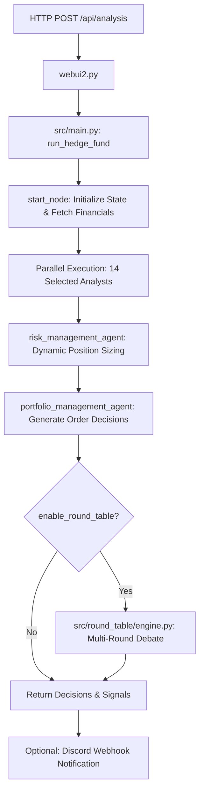

# 🤖 Codebase Architecture & AI Developer Guide (AGENTS.md)

This document is the authoritative **Developer & System Architecture Guide** for AI Coding Agents (such as Claude, Antigravity, Cursor, Devin, ChatGPT) working on or extending this repository.

---

## 🏗️ 1. System Overview & Tech Stack

`ai-hedge-fund-API` is a production-grade, multi-agent financial quantitative research and investment committee system. It simulates a modern AI Hedge Fund: multiple specialized investment analysts evaluate equity data in parallel, cross-examine theses through a **Multi-Round Round Table Committee Debate**, and output risk-adjusted portfolio allocation decisions.

### Tech Stack
- **Language**: Python 3.13 (Managed via standard `pip` and virtual environments, Poetry deprecated).
- **Multi-Agent Orchestration**: `langgraph` (v0.2.x), `langchain-core` (v0.3.x).
- **Web API & WebSockets**: Flask, `flask-cors`, `flask-sock` (running by default on port `6000`).
- **Data Validation & Schemas**: `pydantic` (v2.x).
- **Live Search & Scraping**: `2md` series (`2md.aiurl.tw`, `2md.glsoft.ai`, `create360.ai`).
- **LLM Engine**: Primary `deepseek-v4-flash` (`https://nen.com.tw/v1/`) with seamless automatic failover to official OpenAI ChatGPT (`gpt-4o`).

---

## 📂 2. Repository Directory Map & Responsibilities

```
ai-hedge-fund-API/
├── webui2.py                 # Main Flask HTTP/WebSocket API server entrypoint
├── Dockerfile                # Python 3.13 container definition
├── requirements.txt          # Production dependencies
├── skill.md                  # LLM Agent Skill specification (served at /skill.md & /)
├── ANALYSTS.md               # 14 Analyst investment philosophies & models
├── CHANGELOG.md              # Semantic version history
├── static/
│   ├── swagger.json          # OpenAPI 3.0.3 specification
│   └── skill.md              # Static skill guide served by Flask
└── src/
    ├── main.py               # LangGraph workflow compiler & run_hedge_fund() orchestrator
    ├── graph/
    │   └── state.py          # AgentState TypedDict definition
    ├── agents/               # 14 Analyst Agent implementations
    │   ├── warren_buffett.py # DCF intrinsic value, ROE, economic moats
    │   ├── charlie_munger.py # Inversion mental models, pricing power
    │   ├── ben_graham.py     # Net-Net (NCAV), margin of safety
    │   ├── cathie_wood.py    # Disruptive innovation, Wright's law S-curves
    │   ├── bill_ackman.py    # Activist value investing, cash-flow moats
    │   ├── nancy_pelosi.py   # Congressional Stock Act trade tracking
    │   ├── michael_burry.py  # FCF Yield, contrarian sentiment, hidden debt
    │   ├── peter_lynch.py    # PEG ratios, consumer observation
    │   ├── phil_fisher.py    # 15 qualitative points, R&D productivity
    │   ├── wsb_agent.py      # Reddit/2md retail hype, short squeeze, YOLO options
    │   ├── technicals.py     # SMA 20/50/200, RSI, MACD, Bollinger Bands
    │   ├── fundamentals.py   # Financial statements audit, margin expansion
    │   ├── sentiment.py      # Real-time 2md news scoring & SEC insider trading
    │   ├── valuation.py      # DCF modeling & peer relative multiples
    │   ├── risk_manager.py   # Dynamic position limit & stop-loss control
    │   ├── portfolio_manager.py # Final order generation (buy/sell/short/hold)
    │   └── round_table.py    # Round table agent wrapper
    ├── round_table/
    │   ├── engine.py         # Multi-round debate simulator with persona prompt registry
    │   ├── main.py           # run_round_table orchestration
    │   └── display.py        # Terminal formatting with colorama
    ├── tools/
    │   ├── url2md.py         # 2md API client (primary & fallback endpoints)
    │   └── api.py            # Financial data retrieval, Yahoo/AlphaVantage aggregation
    ├── llm/
    │   └── models.py         # LLM model registry & provider factory
    └── utils/
        ├── llm.py            # call_llm() with automatic retry & ChatGPT failover
        └── progress.py       # Progress bar tracking for terminal & WebSockets
```

---

## 🔄 3. Core Execution Flow



---

## 🤖 4. LLM Invocation & Failover Architecture

All LLM calls in the codebase MUST be resilient against upstream provider outages.

1. **Primary Model**:
   - Provider: `OpenAI-Compatible`
   - Base URL: `PRIMARY_BASE_URL` or `OPENAI_BASE_URL` (Default: `https://nen.com.tw/v1`)
   - Model: `deepseek-v4-flash`
   - Key: `PRIMARY_API_KEY` or `OPENAI_API_KEY`
2. **Automatic Failover Model (ChatGPT)**:
   - Base URL: `https://api.openai.com/v1`
   - Model: `gpt-4o`
   - Key: `FALLBACK_API_KEY` or `OPENAI_API_KEY`
3. **Execution Rule**:
   - When calling LLMs inside agents, use `call_llm(...)` located in [src/utils/llm.py](file:///Users/david/git/tbdavid2019/ai-hedge-fund-API/src/utils/llm.py).
   - `call_llm` automatically catches errors from the primary provider, logs a warning, and immediately completes the prompt using the official ChatGPT fallback.

---

## 🌐 5. 2md Search & Scraping Integration Rules

Real-time news search and web-to-markdown extraction must use [src/tools/url2md.py](file:///Users/david/git/tbdavid2019/ai-hedge-fund-API/src/tools/url2md.py):
- **Primary Endpoint**: `https://2md.aiurl.tw/`
- **Fallback 1**: `https://2md.glsoft.ai/`
- **Fallback 2**: `https://create360.ai/`
- `url2md.py` implements automatic retry and failover across these three nodes.
- When SEC insider trading data is missing (e.g. non-US equities like `2330.TW`), the sentiment agent dynamically shifts to 100% 2md news and social sentiment weighting.

---

## 🛠️ 6. How to Add a New Analyst Agent

When adding a new analyst persona to the system, follow these steps:

1. **Create the agent file** `src/agents/{new_analyst}.py`:
   - Define a Pydantic output model representing the signal (`signal`, `confidence`, `reasoning`).
   - Implement `{new_analyst}_agent(state: AgentState) -> dict`.
   - Call LLM via `call_llm(prompt, model_name, model_provider, pydantic_model=...)`.
2. **Register in LangGraph Workflow** [src/main.py](file:///Users/david/git/tbdavid2019/ai-hedge-fund-API/src/main.py):
   - Import `{new_analyst}_agent` and add it to `workflow.add_node(...)`.
   - Connect edges from `start_node` to `{new_analyst}_agent` and to `risk_management_agent`.
3. **Register Persona in Debate Engine** [src/round_table/engine.py](file:///Users/david/git/tbdavid2019/ai-hedge-fund-API/src/round_table/engine.py):
   - Add persona entry to `PERSONA_REGISTRY` with `name`, `style`, and `philosophy`.
4. **Update Documentation**:
   - Add analyst key to [ANALYSTS.md](file:///Users/david/git/tbdavid2019/ai-hedge-fund-API/ANALYSTS.md) and [skill.md](file:///Users/david/git/tbdavid2019/ai-hedge-fund-API/skill.md).

---

## 💻 7. Developer Commands & Lifecycle

### Syntax Verification
Always verify syntax across all modified Python files:
```bash
python3 -m py_compile src/utils/llm.py src/llm/models.py src/main.py webui2.py
```

### Local API Server Execution
```bash
python webui2.py
```

### Docker Container Management (on Server)
```bash
# Build image
docker build --network=host -t ai-hedge-fund-api .

# Run / restart container with volume mount for hot reloading
docker stop nice_jemison && docker rm nice_jemison
docker run -d --name nice_jemison \
  --env-file .env \
  -v $(pwd)/src:/app/src \
  -v $(pwd)/webui2.py:/app/webui2.py \
  -v $(pwd)/static:/app/static \
  --restart always \
  -p 6000:6000 \
  ai-hedge-fund-api
```

### Test API Endpoints
```bash
# Health check
curl -i http://localhost:6000/api/health

# Run analysis (Server automatically uses deepseek-v4-flash with ChatGPT fallback)
curl -X POST "http://localhost:6000/api/analysis" \
     -H "Content-Type: application/json" \
     -d '{"tickers": "TSLA", "enableRoundTable": true, "roundTableRounds": 1}'
```
